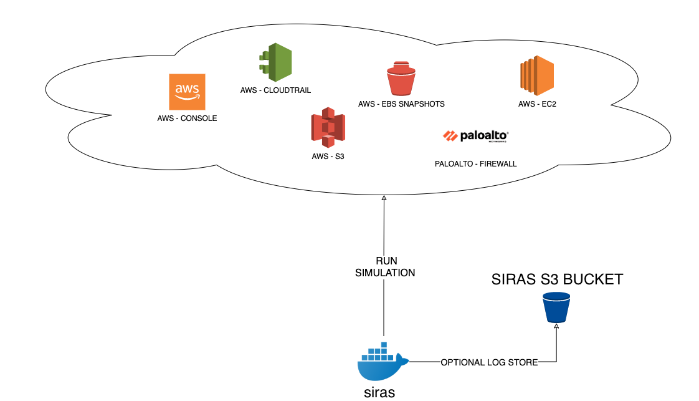

# ***SIRAS*** (Security Incident Response Automated Simulations)

Security Incident Response Automated Simulations (SIRAS) are internal events that provide a structured opportunity to practice the incident response plan and procedures during a realistic scenario. 

The system is currently available for *AWS*, but it is to be extended to others cloud platforms.

### How it works?



### How to run it?

#### Using the official Docker image:

```bash
docker run --rm \
    -e AWS_ACCESS_KEY_ID \
    -e AWS_SECRET_ACCESS_KEY \
    -e AWS_SESSION_TOKEN \
    -e AWS_DEFAULT_REGION=us-east-1 \
    stuxend/siras:latest -s XXXX -B XXXX
```

#### Running Docker build:

1. Build the Docker image.
```bash
docker build -t siras .
```

2. Run the container by passing your aws credentials.
```bash
docker run --rm \
    -e AWS_ACCESS_KEY_ID \
    -e AWS_SECRET_ACCESS_KEY \
    -e AWS_SESSION_TOKEN \
    -e AWS_DEFAULT_REGION=us-east-1 \
    cloud-droid -s XXXX -B XXXX
```

#### Mandatory command options for running ***siras***

You must use the ***-s*** option to run a ***Smoker***.

| -s  | Description  |
| :------------ |:---------------|
| **all** | Run all ***Smokers*** |
| **test** | Test SIRAS |
| **sg** | Create an open security group |
| **pa** | Multiple authentication failure in Palo Alto VPN portal. Must configure ***pano_url*** located in ***smoker/PanAuthSmoker.py*** |
| **au** | Create an administrator user |
| **aca** | Multiple authentication failure in AWS console. Must configure ***account_id*** located in ***smoker/awsConsoleAuthSmoker.py*** |
| **ctr** | Create a CloudTrail trail  |
| **s3p** | Create a public S3 bucket |
| **esb** | Create a public EBS snapshot. Must configure a snapshot id in ***smoker/EBSPublicSmoker*** - line27 |

#### Optional command options to run ***SIRAS***

| -b  | Description |
| --------------|-------------|
| **True** | Store the results in an S3 bucket |
| **False** | This is the default option, it prints the output on the console |

### Requirements
- Docker
- AWS Credentials
- Variable named 'BUCKETS3' to store records in S3.

### Upcoming ***Smokers***
- Kubernetes
- AWS VPC changes
- AWS EC2
- GuardDuty

### Get Involved
* [EMAIL](mailto:contact+siras@sochub.io)

### Contributing
We welcome all contributions, suggestions, and feedback, so please do not hesitate to reach out. 

Ways you can contribute:
1. Report potential bugs 
2. Request a feature
3. Join our community
4. Submit a PR for open issues
5. Fix or improve documentation

### Code of Conduct

This project adheres to the Linux Foundation [Code of Conduct](https://events.linuxfoundation.org/about/code-of-conduct/) available on the event page. By participating, you are expected to honor this code.
